# Sizzle and Steak

Sizzle and Steak is a fictional restaurant located beside the sea in County Antrim, Northern Ireland. The app is a restaurant management system designed too allow staff to easily manage the menus and bookings. It also provides customers with a simple, easy to use booking system where they can view and manage their own reservations.

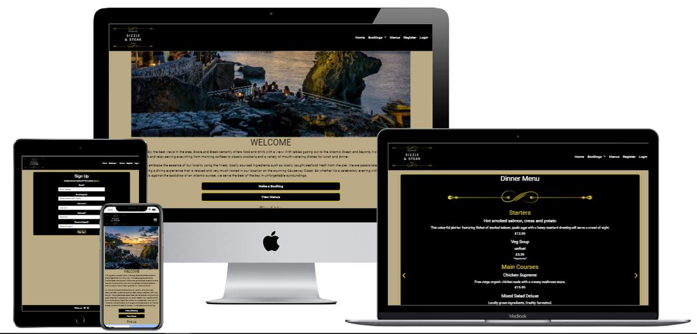

## Table of Contents
* [User Experience Design (UX)](#User-Experience-Design)
    * [The Strategy Plane](#The-Strategy-Plane)
        * [Site Goals](#Site-Goals)
        * [Agile Planning](#Agile-Planning)
          * [Epics](#Epics)
          * [User Stories](#User-Stories)
    * [The Scope Plane](#The-Scope-Plane)
    * [The Structure Plane](#The-Structure-Plane)
      * [Features](#Features)
      * [Future Features](#Features-Left-to-Implement)
    * [The Skeleton Plane](#The-Skeleton-Plane)
        * [Wireframes](#Wireframes)
        * [Database Design](#Database-Design)
        * [Security](#Security)
    * [The Surface Plane](#The-Surface-Plane)
        * [Design](#Design)
            * [Colour Scheme](#Colour-Scheme)
            * [Typography](#Typography)
            * [Imagery](#Imagery)
* [Technologies](#Technologies)
* [Testing](#Testing)
* [Deployment](#Deployment)
    * [Version Control](#Version-Control)
    * [Heroku Deployment](#Heroku-Deployment)
    * [Run Locally](#Run-Locally)
    * [Fork Project](#Fork-Project)
* [Credits](#Credits)
  * [Content](#Content)
  * [Acknowledgements](#Acknowledgements)

# User-Experience-Design

## The-Strategy-Plane

### Site-Goals

The site is aimed to helped restaurant staff to easily manage their menus displayed on the website, as well as keeping track of upcoming bookings and capacity, editing and deleting as neccessary. 

The site also aims too provide customers with a simple, hassle free way to make reservations without the need to call the restaurant. They will also be able to cancel their bookings or update when needed.

### Agile Planning

This project was developed using agile methadologies by delivering small features in incremental sprints. There were 3 sprints in total, spaced out evenly over four weeks.

All projects were assigned to epics, prioritized under the labels, Must have, should have, could have. They were assigned to sprints and story pointed according to complexity. Must have stories were completed first, should haves and then finally should haves. It was done this way to ensure that all core requirements were completed first to give the project a complete feel, with the nice to have features being added should there be capacity.

The Kanban board was created using github projects and can be located [here](https://github.com/Gareth-McGirr/Portfolio-Project-4-SizzleAndSteak/projects/1) and can be viewed to see more information on the project cards. All stories expect the documentation tasks have full set of aceptance criteria in order to define the functionality that marks that story as complete.

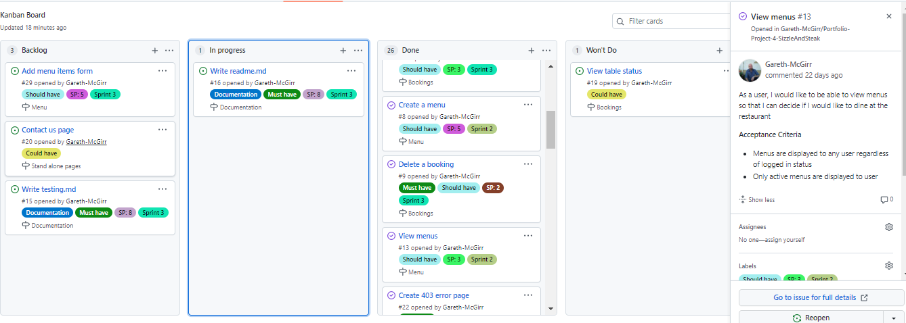

#### Epics

The project had 7 main Epics (milestones):

**EPIC 1 - Base Setup**

The base setup epic is for all stories needed for the base set up of the application. Without the base setup, the app would not be possible so it was the first epic to be delivered as all other features depend on the completion of the base setup.

**EPIC 2 - Stand alone Pages**

The stand alone pages epic are for small pages that did not have enough stories to warrant their own full epics. Instead of creating epics for tiny features, these small deliverables were all added under this epic.

**EPIC 3 - Authentication Epic**

The authentication epic is for all stories related to the registration, login and authorization of views. This epic provides critical functionality and value as without it the staff would not be able to managed the bookings securely without regular site visitors also being able to see and perform actions.

**EPIC 4 - Menu**

The menu epic is for all stories that relate to the creating, deleting, editing and viewing of menus. This allows for regular users to view menus and for staff to manage them with a simple UI interface.

**EPIC 5 - Booking**

The booking epic is for all stories that relate to creating, viewing, updating and deleting bookings. This allows the staff to easily view upcoming bookings, manage the bookings and also for customers to book and manage their own reservations.

**EPIC 6 - Deployment Epic**

This epic is for all stories related to deploying the app to heroku so that is live for staff and customer use.

**EPIC 7 - Documentation**

This epic is for all document related stories and tasks that are needed to document the software development lifecycle of the application. It aims to deliver quality documentation, explaining all stages of development and necessary information on running, deploying and using the application.

#### User Stories

The following user stories (by epic) were completed over the 3 sprints:

**EPIC 1 - Base Setup**

As a developer, I need to create the base.html page and structure so that other pages can reuse the layout

As a developer, I need to create static resources so that images, css and javascript work on the website

As a developer, I need to set up the project so that it is ready for implementing the core features

As a developer, I need to create the footer with social media links and contact information

As a developer, I need to create the navbar so that users can navigate the website from any device

**EPIC 2 - Stand alone Pages**

As a developer, I need to implement a 404 error page to alert users when they have accessed a page that doesn't exist

As a developer, I need to implement a 500 error page to alert users when an internal server error occurs

As a developer, I need to implement a 403 error page to redirect unauthorised users to so that I can secure my views

As a restaurant owner, I would like a home page so that customers can view information on my restaurant

**EPIC 3 - Authentication Epic**

As a developer, I need to implement allauth so that users can sign up and have access to the websites features

As a Site Owner, I want users to verify their email when registering an account so that I can ensure that a valid email address is being used.

As a site owner, I would like the allauth pages customized to that they fit in with the sites styling

**EPIC 4 - Menu**

As a staff user, I want to be able to create a new menu when we have new dishes to offer

As a user, I would like to be able to view menus so that I can decide if I would like to dine at the restaurant

As a staff user, I want to be able to edit a menu when updates are needed

As a staff member, I would like to receive feedback when I create or update menus so that I can see they have worked

As a staff user, I want to be able to delete a menu when it is no longer used

**EPIC 5 - Booking**

As a user, I would like to be able to create a new booking when I want to visit the restaurant

As a user, I would like to view my bookings when I need to check the information

As a user, I would like to be able to edit a booking so that I can make changes when needed

As a user, I would like to receive feedback when I create a booking or edit one so I know it was completed successfully

As a staff user, I want to be able to search a booking by reference to save time searching

As a user I would like to delete a booking when I no longer require it

**EPIC 6 - Deployment Epic**

As a developer, I need to set up whitenoise so that my static files are served in deployment

As a developer, I need to deploy the project to heroku so that it is live for customers

**EPIC 7 - Documentation**

Tasks:

* Complete readme documentation
* Complete testing documentation write up

## The-Scope-Plane

* Responsive Design - Site should be fully functional on all devices from 320px up
* Ham burger menu for mobile devices
* Ability to perform CRUD functionality on Menus and Bookings
* Restricted role based features
* Home page with resturant information

## The-Structure-Plane

### Features

``USER STORY - As a developer, I need to create the navbar so that users can navigate the website from any device``

Implementation:

**Navigation Menu**

 The Navigation contains links for Home, Bookings, Menus and has allauth options.

The following navigation items are available on all pages:
  * Home -> index.html - Visible to all
  * Bookings (Drop Down):
    * Manage Bookings -> managebookings.html - Visible to logged in users
    * New Booking -> booking.html - Visible to logged in users
  * Menus (Drop Down):
    * View Menus -> menus.html - Visible to all
    * Create Menu -> create_menu.html - Visible to staff
    * Manage Menus -> managemenus - Visible to staff
  * Login -> login.html - Visible to logged out users
  * Register -> signup.html - Visible to logged out users
  * Logout -> logout.html - Visible to logged in users

The navigation menu is displayed on all pages and drops down into a hamburger menu on smaller devices. This will allow users to view the site from any device and not take up too much space on mobile devices.

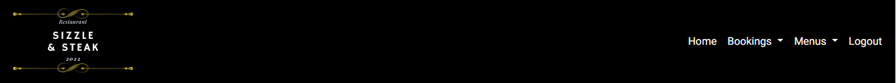

``USER STORY - As a restaurant owner, I would like a home page so that customers can view information on my restaurant``

Implementation:

**Home Page**

The home page contains a hero image of a seaside restaurant and the resturant information at the top of the page. This will immediately make it evident to the user, what the purpose of the web site is.

Under the information section are two buttons, 'Make a booking' and 'View Menus'. These buttons will allow the user a quick way to the respective pages if they wish to make a booking or view the restaurants active menus.

The last section of the home page contains a google map, marking the location of the restaurant and the opening hours of the restaurant. This will allow the user to locate the restaurant and operating times.


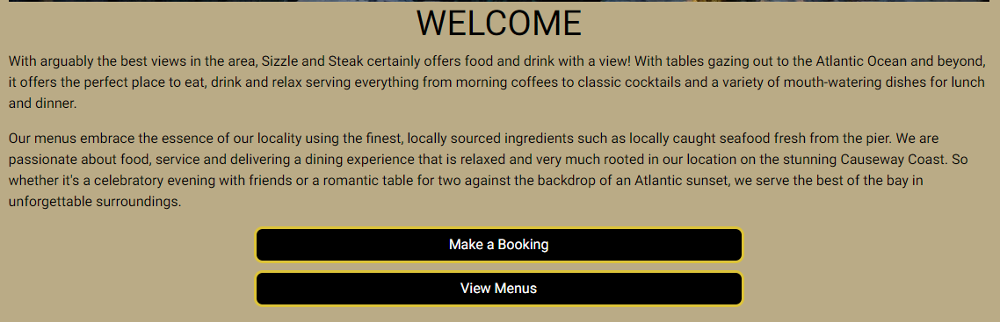

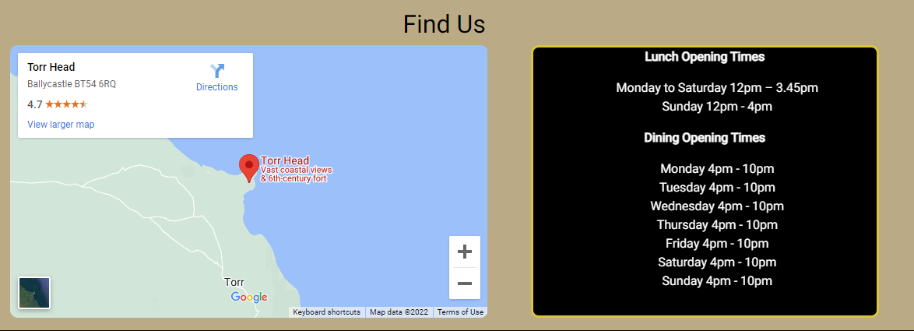


``USER STORY - As a developer, I need to create the footer with social media links and contact information``

Implementation:

**Footer**

A footer has been added to the bottom of the site, this contains a Twitter and Facebook link so that users can follow the restaurant on social media if they want to keep up to date with special offers not advertised on the website. These icons has aria-labels added to ensure users with assistive screen reading technology know what the purpose of the links are for. They also open in new tabs as they lead users away from the site.


``USER STORY - As a staff user, I want to be able to create a new menu when we have new dishes to offer``

Implementation:

**Create Menu Page**

A create menu page was implemented to allow staff users to create new menus via the UI without having to use the backend admin panel. This will allow staff the ability to quickly update menus when they have made changes to the food being offered.

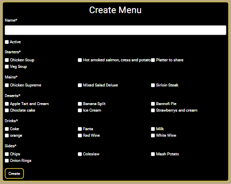

``USER STORY -As a user, I would like to be able to view menus so that I can decide if I would like to dine at the restaurant``

Implementation:

**View Menu Page**

A menu page has been implemented to allow users to see the current active menus and decide whether they are interested in the food we offer before booking. This is visible to all users regardless of logged in state as it is not user friendly to restrict core information from users to force them into signing up.

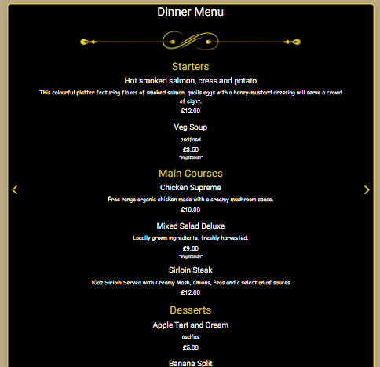

``USER STORY -As a staff user, I want to be able to edit a menu when updates are needed``

Implementation:

**Edit Menu Page**

On the manage menus page a button was added to allow staff members to edit a menu when changes need to be made.

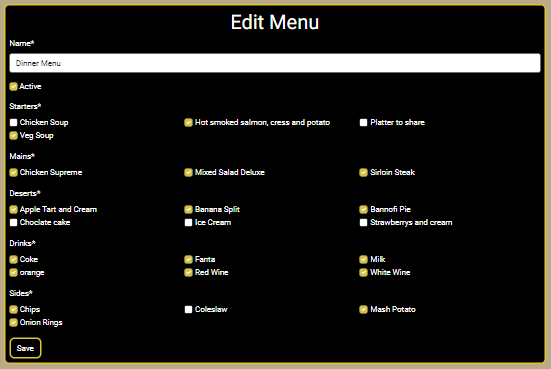

``USER STORY -As a staff member, I would like to receive feedback when I create or update menus so that I can see they have worked``

Implementation:

**Toasts**

Custom toasts were added on successful creation and deletion of menus which dsplay success messages to the user to enable them to see that the action completed successfully.

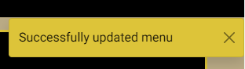

``USER STORY -As a staff user, I want to be able to delete a menu when it is no longer used``

Implementation:

**Delete Menu Page**

On the manage menus page, a delete button has been implemented that will take staff users to a confirmation page to allow them to delete a menu. This will allow staff to delete menus when they are no longer needed

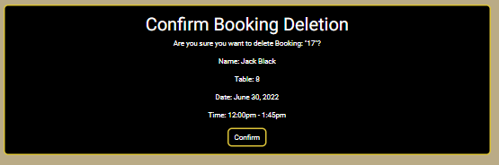

``USER-STORY - As a user, I would like to be able to create a new booking when I want to visit the restaurant``

Implementation:

**Create booking page**

A booking page was implemented with a form that takes in the customer details and enables the user to easily make a booking through the UI. The form does not take in the logged in users name but it is added on the back end through the form valid function. 

Extensive logic was added to the form validation to ensure that not only is there a table available for the users chosen time and date but also that it has enough seats for the amount of guests. If the form is successful with validation on the front end, logic is in place to find the lowest capacity table to seat the guests for the given date and time.

This allows for seat optimisation to ensure we do not have small amounts of guests at tables that could of been booked for larger groups. Ensuring table optimisation and revenue for the restaurant.

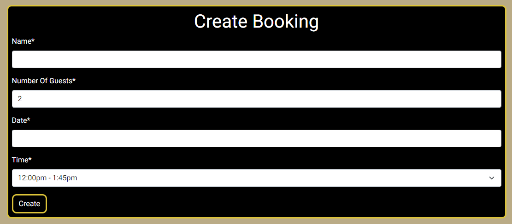

``USER-STORY - As a user, I would like to view my bookings when I need to check the information``

Implementation:

**Manage bookings page**

A manage bookings page was implemented with validation checks on the user. This shows all of the users bookings bookings. This will allow the user to view their upcoming bookings when needed.

For restaurant staff users, all bookings will be available to display so that can can easily view numbers and future bookings.

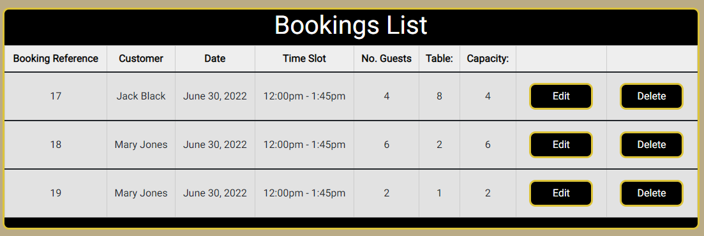

``USER-STORY - As a user, I would like to be able to edit a booking so that I can make changes when needed``

Implementation:

**Edit Booking Page**

On the manage bookings page an edit button is present that allows the user to direct to a form and update their booking when required. This will allow the user to easily manage their own booking.

For staff users, they can also edit bookings from the manage booking page, even if they did not create the reservation. This will allow restaurant staff to ammend details as needed.

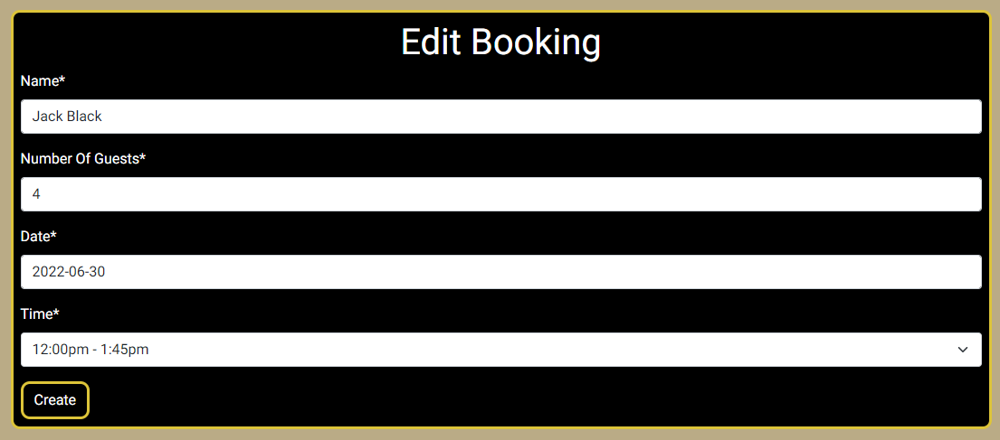

``USER-STORY - As a user, I would like to receive feedback when I create a booking or edit one so I know it was completed successfully``

Implementation:

**Toasts**

Custom toasts were implemented on the successful creation and editing of bookings. This will provide feedback to the user to relay information that the booking was successfully recieved or updated.

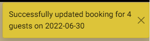

``USER-STORY - As a staff user, I want to be able to search a booking by reference to save time searching``

Implementation:

**Searchbox**

A search box was added to the manage bookings page that is only visible to staff users. This will allow the staff members to easily locate a booking by reference number if they need to find it quickly.

[Search Boxes](docs/readme_images/search.PNG)

``USER-STORY - As a user I would like to delete a booking when I no longer require it``

Implementation:

**Delete Booking Page**

A delete button was added to the manage bookings page that will allow customers to delete their booking should they no longer require it without the need to call the restaurant.

For staff members, they also have the abaility to delete any booking through the UI as well. This will allow staff to free up table capacity should a customer call to cancel their booking.

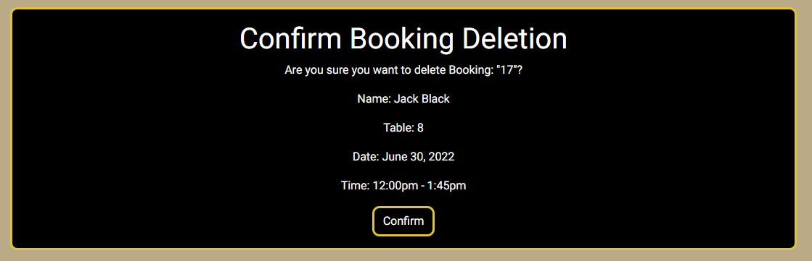

Favicon
    * A site wide favicon will be implemented with .....
    * This will provide an image in the the tabs header to allow the user to easily identify the website if they have multiple tabs open.

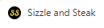

**Error Pages**

``USER STORY - As a developer, I need to implement a 404 error page to alert users when they have accessed a page that doesn't exist``

Implementation:

**404 Page**

As a developer, I need to implement a 403 error page to redirect unauthorised users to so that I can secure my views

A 404 page has been implemented and will display if a user navigates to a broken link.

The 404 page will allow the user to easily navigate back to the main website if they direct to a broken link / missing page, without the need  of the browsers back button.

``USER STORY - As a developer, I need to implement a 500 error page to alert users when an internal server error occurs``

Implementation:

**403 Page**

A 403 error page has been implemented to provide feedback to the user when they try to access unauthorized content. Users will be directed to this page if they alter the URL's and attempt to edit, delete or access pages that are restricted. 

This covers:

* Create Menu - Only authorized to staff
* Edit Menu - Only authorized to staff
* Delete Menu - Only authorized to staff
* Edit Booking - Only authorized to the customer who created the booking or a staff member
* Delete booking - Only authorized to the customer who created the booking or a staff member

``USER STORY - As a developer, I need to implement a 500 error page to alert users when an internal server error occurs``

Implementation:

**500 Page**

A 500 error page has been displayed to alert users when an internal server error occurs. The message relays to users that the problem is on our end, not theirs.

**Base Setup User Stories**

The following stories were implemented in order to set up a base structure for all the HTML pages and the core installations and configurations needed to run the application. While these do not show as individual features, they were stories completed that were needed to implement all of the stories above.

``As a developer, I need to create the base.html page and structure so that other pages can reuse the layout``

``As a developer, I need to create static resources so that images, css and javascript work on the website``

``As a developer, I need to set up the project so that it is ready for implementing the core features``

**Favicon**

A favicon was added the website to enable users to easily locate the website in the browser when multiple tabs are open.

### Features Left To Implement
- Add any features that are not yet implemented


## The-Skeleton-Plane

### Wireframes

- Home page


- Signup page


- Log in


- Log Out

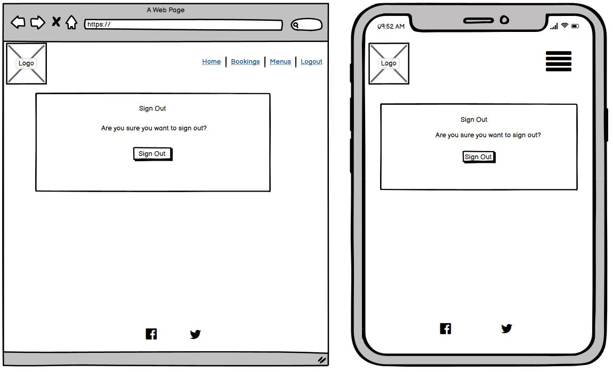

- Create Booking

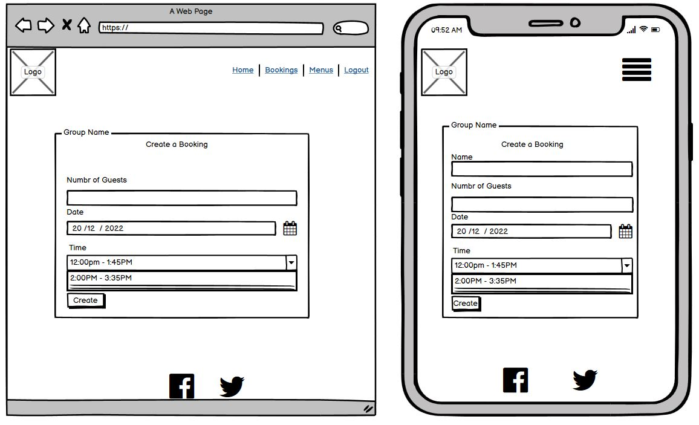

- Edit Booking 

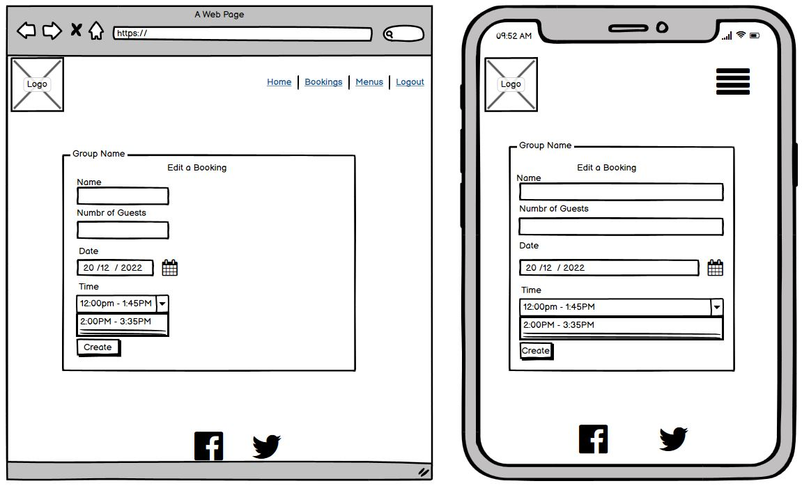

- Manage Bookings

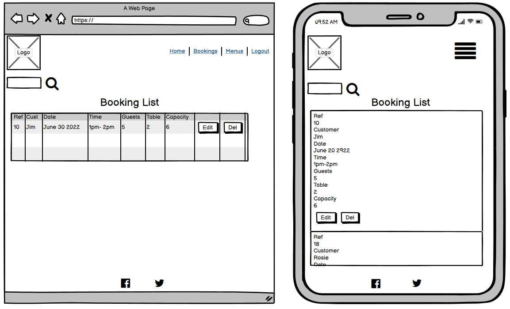

- Delete Booking 

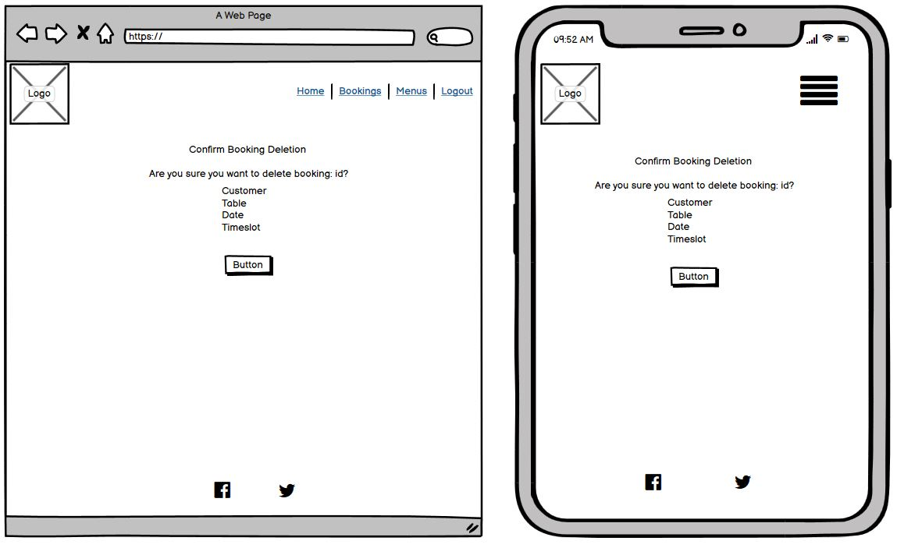

- Create Menu 

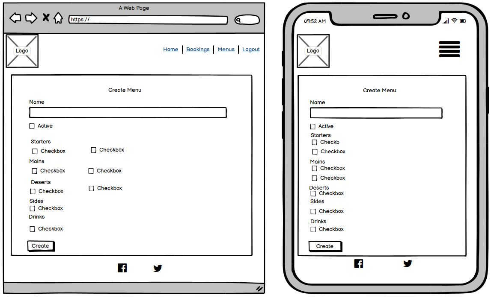

- Edit Menu 

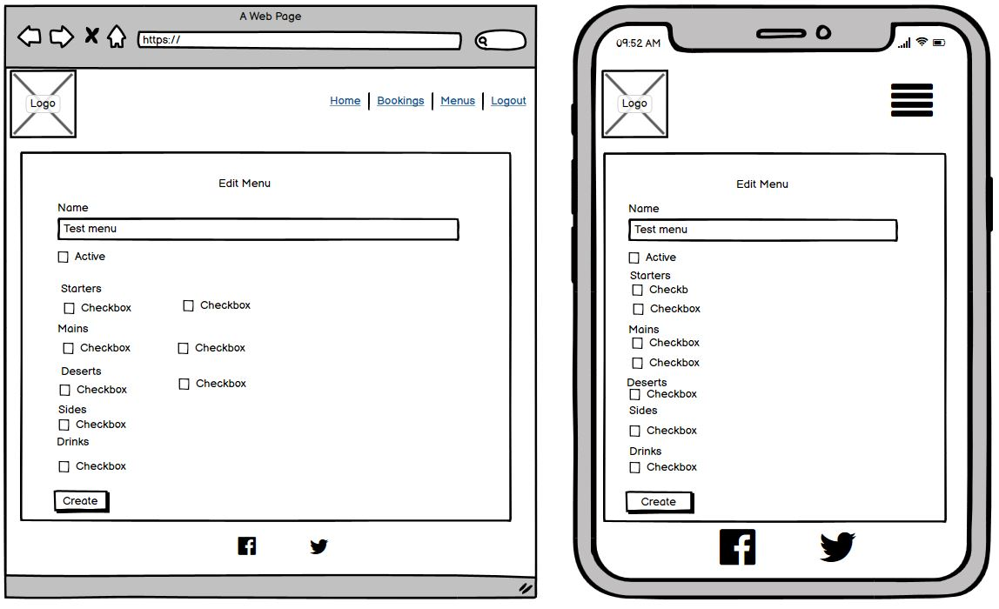

- View Menu 

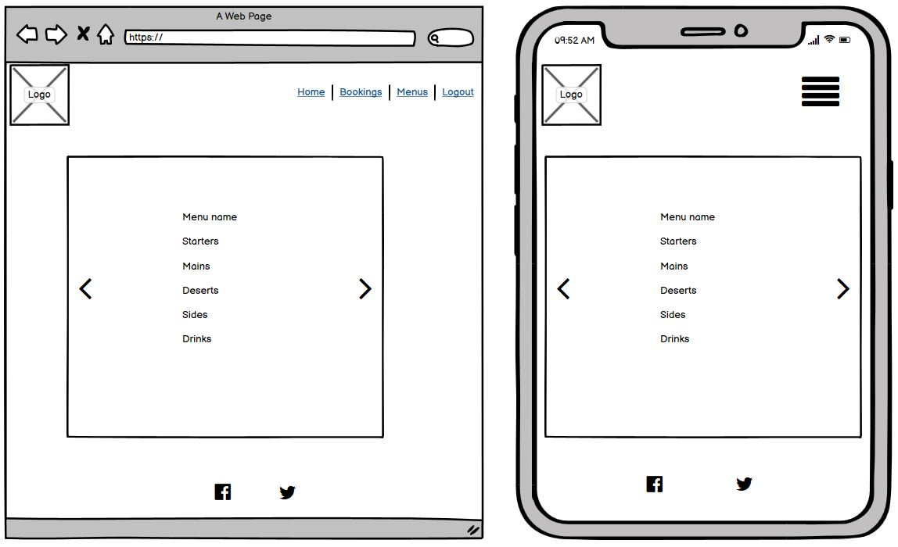


- Manage Menus

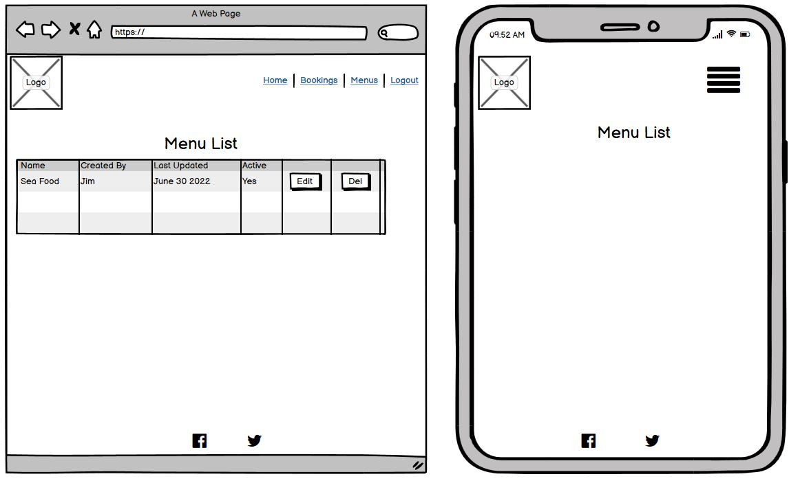

- Delete Menu 


- 404 Error 


- 403 Error 


- 500 Error 

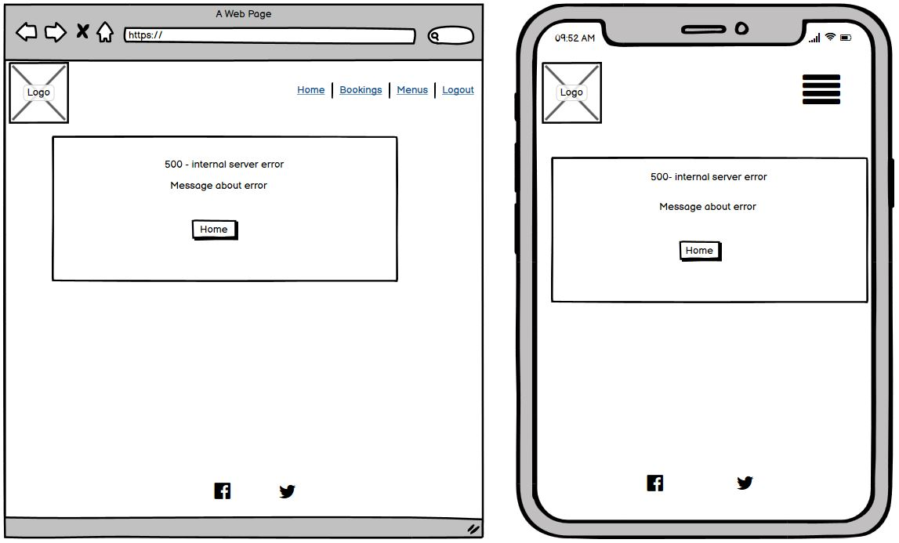

### Database-Design

The database was designed to allow CRUD functionality to be available to registered users, when signed in. The user model is at the heart of the application as it is connected the the main booking and menu tables, linked by primary/foreign key relationships.

The Menu Items model holds objects that are linked to the Menu Models by a many to many relationship. This allows for staff to create menus with many menu items on.

Bookings are related to the customer (user) by a Foreign Key which allows the users to be able to view and update bookings attached to their accounts.

Entity relationship diagram was created using [DBVisualizer](https://www.dbvis.com/) and shows the schemas for each of the models and how they are related.

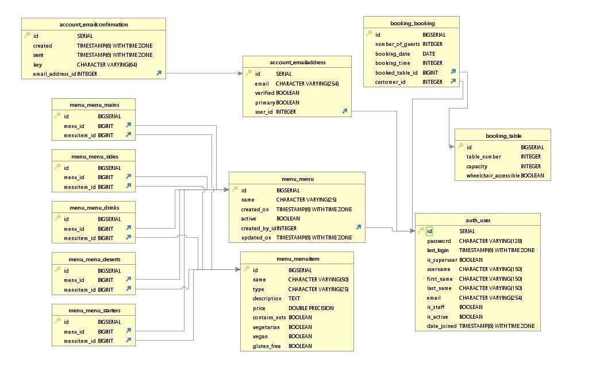

### Security

Views were secured by using the django class based view mixin, UserPassesTextMixin. A test function was created to use the mixin and checks were ran to ensure that the user who is trying to access the oage is authorized. Any staff restricted functionality, user edit/delete functionality listed in the features was secured using this method.

## The-Surface-Plane
### Design

### Colour-Scheme

The main color schemes for the website are black (#000000) back ground. White font (#FFF) and the gold (#8f773c9e) was added to borders, button text and hover affects to add a hint of color to the website.

### Typography

The Roboto font was used throughout the website. This font is from google fonts and was imported into the style sheet.

### Imagery

The Website logo was made using Canva using the Gold colour to match in with the website color scheme.

The hero image was taken from Pexels which is a royalty free image site.


## Technolgies

- HTML
  - The structure of the Website was developed using HTML as the main language.
- CSS
  - The Website was styled using custom CSS in an external file.
- JavaScript
  - JavaScript was used to make the custom slider on the menu page change and the bootstrap date picker.
- Python
  - Python was the main programming language used for the application using the Django Framework.
- Visual Studio Code
  - The website was developed using Visual Studio Code IDE
- GitHub
  - Source code is hosted on GitHub
- Git
  - Used to commit and push code during the development of the Website
- Font Awesome
  - This was used for various icons throughout the site
- Favicon.io
  - favicon files were created at https://favicon.io/favicon-converter/
- balsamiq
  - wireframes were created using balsamiq from https://balsamiq.com/wireframes/desktop/#
- Canva
  - This was used to create the logo in header 
- TinyPNG
  - This was used to compress the hero image for optimal load times

**Python Modules Used**

* Django Class based views (ListView, UpdateView, DeleteView, CreateView) - Used for the classes to create, read, update and delete
* Mixins (LoginRequiredMixin, UserPassesTestMixin) - Used to enforce login required on views and test user is authorized to perform actions
* messages - Used to pass messages to the toasts to display feedback to the user upon actions
* timedelta, date - Date was used in order to search for objects by date and timedelta for searching date ranges

**External Python Modules**

* cloudinary==1.29.0 - Cloundinary was set up for use but no custom uploads were made, settings remain for future development
* crispy-bootstrap5==0.6 - This was used to allow bootstrap5 use with crispy forms
* cryptography==37.0.2 - Installed as dependency with another package
* defusedxml==0.7.1 - Installed as dependency with another package
* dj-database-url==0.5.0 - Used to parse database url for production environment
* dj3-cloudinary-storage==0.0.6 - Storage system to work with cloudinary
* Django==4.0.5 - Framework used to build the application
* django-admin-rangefilter==0.8.4 - This was used to search bookings in the admin for a range between 2 dates
* django-allauth==0.51.0 - Used for the sites authentication system, sign up, sign in, logout, password resets ect.
* django-crispy-forms==1.14.0 - Used to style the forms on render
* django-model-utils==4.2.0 - Installed as dependency with another package
* gunicorn==20.1.0 - Installed as dependency with another package
* idna==3.3 - Installed as dependency with another package
* oauthlib==3.2.0 - Installed as dependency with another package
* psycopg2==2.9.3 - Needed for heroku deployment
* pycparser==2.21 - Installed as dependency with another package
* PyJWT==2.4.0 - Installed as dependency with another package
* python3-openid==3.2.0 - Installed as dependency with another package
* requests==2.27.1 - Installed as dependency with another package
* requests-oauthlib==1.3.1 - Installed as dependency with another package (allauth authentication)
* six==1.16.0 - Installed as dependency with another package
* sqlparse==0.4.2 - Installed as dependency with another package
* tzdata==2022.1 - Installed as dependency with another package
* urllib3==1.26.9 - Installed as dependency with another package
* whitenoise==6.2.0 - Used to serve static files directly without use of static resource provider like cloundinary

## Testing

Test cases and results can be found in the [TESTING.md](TESTING.md) file. This was moved due to the size of the file.

## Deployment

### Version Control

The site was created using the Visual Studio Code editor and pushed to github to the remote repository ‘Gars-Steakhouse’.

The following git commands were used throughout development to push code to the remote repo:

```git add <file>``` - This command was used to add the file(s) to the staging area before they are committed.

```git commit -m “commit message”``` - This command was used to commit changes to the local repository queue ready for the final step.

```git push``` - This command was used to push all committed code to the remote repository on github.

### Heroku Deployment

The site was deployed to Heroku. The steps to deploy are as follows:

- Navigate to heroku and create an account
- Click the new button in the top right corner
- Select create new app
- Enter app name
- Select region and click create app
- Click the resources tab and search for Heroku Postgres
- Select hobby dev and continue
- Go to the settings tab and then click reveal config vars
- Add the following config vars:
  - SECRET_KEY: (Your secret key)
  - DATABASE_URL: (This should already exist with add on of postgres)
  - EMAIL_HOST_USER: (email address)
  - EMAIL_HOST_PASS: (email app password)
  - CLOUNDINARY_URL: (cloudinary api url)
- Click the deploy tab
- Scroll down to Connect to GitHub and sign in / authorize when prompted
- In the search box, find the repositoy you want to deploy and click connect
- Scroll down to Manual deploy and choose the main branch
- Click deploy

The app should now be deployed.

The live link can be found here: [Live Site](https://sizzle-and-steak.herokuapp.com/)

### Run Locally

Navigate to the GitHub Repository you want to clone to use locally:

- Click on the code drop down button
- Click on HTTPS
- Copy the repository link to the clipboard
- Open your IDE of choice (git must be installed for the next steps)
- Type git clone copied-git-url into the IDE terminal

The project will now have been cloned on your local machine for use.

### Fork Project

Most commonly, forks are used to either propose changes to someone else's project or to use someone else's project as a starting point for your own idea.

- Navigate to the GitHub Repository you want to fork.

- On the top right of the page under the header, click the fork button.

- This will create a duplicate of the full project in your GitHub Repository.

## Credits 

The [Hero Image](https://www.pexels.com/photo/people-dining-at-an-al-fresco-restaurant-by-the-sea-6446203/) was taken from pexels.
