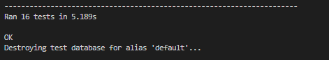
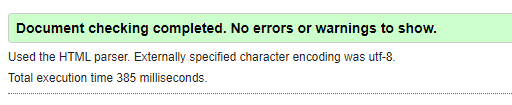
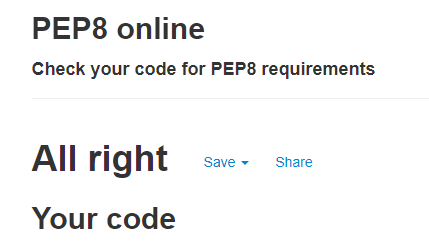
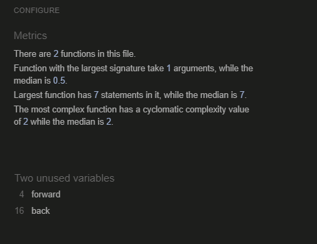
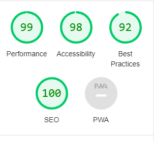

## Functional Testing

**Authentication**

Description:

Ensure a user can sign up to the website

Steps:

1. Navigate to [sizzle-and-steak](https://sizzle-and-steak.herokuapp.com) and click Register
2. Enter email, username and password 
3. Click Sign up

Expected:

An email is recieved with a link to sign up, upon clicking the link, registration is successful

Actual: 

An email is recieved with a link to sign up, upon clicking the link, registration is successful

Description:

Ensure a user can log in once signed up

Steps:
1. Navigate to [sizzle-and-steak](https://sizzle-and-steak.herokuapp.com)
2. Enter login detailscreated in previous test case
3. Click login

Expected:

User is successfully logged in and redirected to the home page

Actual:

User is successfully logged in and redirected to the home page

Description:

Ensure a user can sign out

Steps:

1. Login to the website
2. Click the logout button
3. Click confirm on the confirm logout page

Expected:

User is logged out

Actual:

User is logged out

**Booking Forms**

Description:

Ensure a new booking can be created.

Steps:

1. Navigate to [page](https://sizzle-and-steak.herokuapp.com/booking/createbooking/) - Login if prompted.
2. Enter the following:
    - Name: Gareth
    - No Of Guests: 3
    - Date: Any future date
    - Time: Any drop down field
3. Click Create

Expected:

Form successfully submits and a toast is shown to alert the user of successful booking.

Actual:

Form successfully submits and a toast is shown to alert the user of successful booking.

 

Description:

Ensure a booking can be edited.

Steps:

1. Navigate to [page](https://sizzle-and-steak.herokuapp.com/booking/managebookings/) - Login if prompted.
2. Enter the following:
    - Name: Gareth
    - No Of Guests: 5
    - Date: Any future date
    - Time: Any drop down field
3. Click Create

Expected:

Form successfully submits and a toast is shown to alert the user of updated booking.

Actual:

Form successfully submits and a toast is shown to alert the user of updated booking.

Description:

Ensure user can successfully delete a booking.

Steps:
1. Login as a user with a booking or create a new booking
2. Click the Manage Booking nav link
3. Click the delete button on a booking
4. Click the confirm button on the delete page

Expected:

Booking is successfully deleted

Actual:

Booking is successfully deleted

**Menu Pages**

Description:

Ensure a new menu item can be added

Steps:

1. Navigate to the create menu item page from the menu drop down nav item
2. Enter the following details:
    - Name: Test Menu
    - Type: Starter
    - Description: Test Item
    - Price: 15.00
    - Checkbox: Contains Nuts

3. Click Create

Expected:

New menu item is sucessfully added and can be added to a new menu

Actual:

New menu item is sucessfully added and can be added to a new menu

Description:

Ensure a new menu can be created

Steps:

1. Sign in as a staff user
2. Select the Create Menu item in the Menu drop down nav bar
3. Enter the follow details:
    - Name: Test Menu
    - Starters: Chicken Veg Soup
    - Mains: Chicken Supreme
    - Deserts: Choclate Cake
    - Drinks: Coke
    - Sides: Chips
4. Click Create

Expected:

New menu is created and can be viewed on the View Menus page

Actual:

New menu is created and can be viewed on the View Menus page

Description:

Ensure a menu can be updated

Steps:

1. Navigate to the manage mennus page from the menus drop down nav link
2. Click edit on a menu
3. Update a menu item and submit the form

Expected:

Menu has been updated and a toast message displayed to the user it was updated

Actual: 

Menu has been updated and a toast message displayed to the user it was updated

Description:

Ensure a menu can be deleted

Steps:

1. Navigate to the manage menus page from the menus drop down nav link
2. Click the delete button on a menu
3. On the delete confirmation page click confirm

Expected:

Menu has been deleted and cannot be seen on the menus page

Actual:

Menu has been deleted and cannot be seen on the menus page

**Navigation Links**

Testing was performed to ensure all navigation links on the respective pages, navigated to the correct pages as per design. This was done by clicking on the navigation links on each page.

- Home -> index.html
- Bookings Drop Down, Manage Bookings -> managebookings.html
- Bookings Drop Down, New Booking -> create_booking.html
- Menus Drop Down, View Menu -> menus.html
- Menus Drop Down, Create Menu -> create_menu.html
- Menus Drop Down, Manage Menus => manage_menus.html
- Logout -> Sign out all auth page
- Login -> Sign in all auth page
- Register -> Sign up all auth page

All navigation links directed to the corect pages as expected.

**Footer**

Testing was performed on the footer links by clicking the font awesome icons and ensuring that the facebook icon opened facebook in a new tab and the twitter icon opened twitter in a new tab. These behaved as expected.

## Negative Testing

Tests were performed on the create booking to ensure that:

1. A customer cannot book a date in the past
2. A customer cannot book if no tables are available for the amount of guests
3. A customer cannot edit a booking with an increased guest size if no tables have capacity
4. Forms cannot be submitted when required fields are empty

## Unit Testing

Unit tests were created to test some basic functionality such as templates used and redirects. These can be found in the tests.py files in the respective apps.

Results:

## Accessibility

[Wave Accessibility](https://wave.webaim.org/) tool was used throughout development and for final testing of the deployed website to check for any aid accessibility testing.

Testing was focused to ensure the following criteria were met:

- All forms have associated labels or aria-labels so that this is read out on a screen reader to users who tab to form inputs
- Color contrasts meet a minimum ratio as specified in [WCAG 2.1 Contrast Guidelines](https://www.w3.org/WAI/WCAG21/Understanding/contrast-minimum.html)
- Heading levels are not missed or skipped to ensure the importance of content is relayed correctly to the end user
- All content is contained within landmarks to ensure ease of use for assistive technology, allowing the user to navigate by page regions
- All not textual content had alternative text or titles so descriptions are read out to screen readers
- HTML page lang attribute has been set
- Aria properties have been implemented correctly
- WCAG 2.1 Coding best practices being followed

## Validator Testing

All pages were run through the [w3 HTML Validator](https://validator.w3.org/). Initially there were some errors due to stray script tags, misuse of headings within spans and some unclosed elements. All of these issues were corrected and all pages passed validation.

Due to the django templating language code used in the HTML files, these could not be copy and pasted into the validator and due to the secured views, pages with login required or a secured view cannot be validated by direct URI. To test the validation on the files, open the page to validate, right click and view page source. Paste the raw html code into the validator as this will be only the HTML rendered code.

All pages were run through the official [Pep8](http://pep8online.com/) validator to ensure all code was pep8 compliant. Some errors were shown due to blank spacing and lines too long, 1 line instead of 2 expected. All of these errors were resolved and code passed through validators with the exception of the settings.py file.

The django auto generated code for AUTH_PASSWORD_VALIDATORS were showing up as lines too long. I could not find a way to split these lines but since they were auto generated and not my own custom code, I hope this is acceptable.

JavaScript code was run through [JSHINT](https://jshint.com) javascript validator. lIt flagged up issues with undefined variables as I jad forgotten to use the let keyword. This was fixed and the only warnings remained were that they were unused variables. The functions were called via onclick from the html elements themselves, so are in fact being used.

## Lighthouse Report

Lighthouse report showed areas for improvement on SEO and Best practices. Meta descriptions and keywords were added to boost the SEO to 100 but the best practice warnings were coming from the use of an embedded iframe's javascript. Unfortunately I did not find a way to improve this as I am not initialising the google map iframe with javascript.

## Responsiveness

All pages were tested to ensure responsiveness on screen sizes from 320px and upwards as defined in WCAG 2.1 Reflow criteria for responsive design on Chrome, Edge, Firefox and Opera browsers.

Steps to test:

- Open browser and navigate to [sizzle-and-steak](https://sizzle-and-steak.herokuapp.com/)
- Open the developer tools (right click and inspect)
- Set to responsive and decrease width to 320px
- Set the zoom to 50%
-  Click and drag the responsive window to maximum width

Expected:

Website is responsive on all screen sizes and no images are pixelated or stretched. No horizontal scroll is present. No elements overlap.

Actual:

Website behaved as expected.

Website was also opened on the following devices and no responsive issues were seen:

Oukitel C21 Pro
TCL 30 Pro
iPhone SE

## Bugs

Logic has been implemented to ensure that when a booking is created that it books the table with the capacity lowest to suit the number of guests. When a user updates a booking, this does not function correctly on the edit and will reassign the booking to another table with the next lowest capacity. It should keep the booking on the current table if it is a lower capacity but unfortunately does not work correctly and has not been resolved in time for submission.